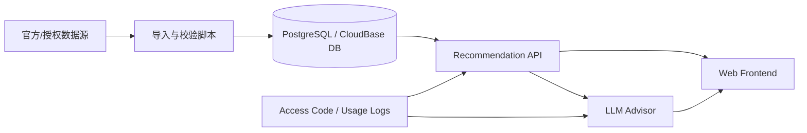

# Architecture

## 目标

这个项目的目标不是“把一个静态网页塞满数据”，而是把高考志愿推荐拆成可维护的产品系统：数据层负责真实性，推荐层负责筛选和排序，大模型层负责解释，前端层负责让普通用户看懂。

## 推荐架构



## 分层说明

### 1. 数据层

保存学校、专业、招生计划、投档线、分专业录取线、一分一段表、城市因子等结构化数据。

原则：

- 原始文件不进 GitHub。
- 每条数据保留来源、年份、科类、批次。
- 重要字段保留 source/hash，便于回溯。
- 过期年份不能当作当年结论，只能作为参考。

### 2. 推荐层

推荐层先用确定性规则产出候选池，再让大模型解释。

核心输入：

- 分数
- 位次
- 科类
- 批次
- 地域偏好
- 专业兴趣
- 职业目标
- 风险偏好

核心输出：

- 冲稳保分层
- 推荐院校/专业
- 录取风险
- 推荐理由
- 数据来源说明

### 3. 大模型层

大模型不能直接“凭空推荐学校”。它只能基于推荐 API 返回的候选池做：

- 通俗解释
- 志愿策略对比
- 大学四年规划
- 毕业后三年、五年、十年模拟
- 家庭沟通建议
- 风险提醒

安全边界：

- 禁止生成候选池外的学校作为确定推荐。
- 禁止伪造录取分数和位次。
- 必须提示以官方数据为准。
- 所有 AI 输出都应带“不构成报考承诺”的说明。

### 4. 前端层

前端可以保留卡通化、小呆呆、移动端友好的表达，但不应该内置全量数据。

前端职责：

- 收集用户画像
- 展示候选结果
- 展示人生模拟
- 提供 AI 咨询入口
- 展示官方链接和数据说明

前端不做的事：

- 不保存 API Key
- 不保存全量招生数据库
- 不把访问码校验写死在浏览器端

## API 草案

```http
GET /health
GET /api/recommend?score=450&rank=120000&subject=history&region=north
POST /api/ai/insights
POST /api/ai/chat
POST /api/access/verify
```

## 为什么比静态 JS 数据更好

静态 JS 数据的问题：

- 全量数据会暴露给任何访问者。
- 手机端加载慢。
- 数据更新必须重新打包部署。
- 无法做访问码、限流、审计。
- 数据授权风险更高。

数据库/API 模式的优势：

- 只返回当前用户需要的候选结果。
- 数据可以独立更新。
- 能做访问控制和使用统计。
- 更适合以后商业化或小范围试运营。
- 更像真实项目，适合放进作品集。

## 可部署形态

### 作品集公开版

- GitHub 公开仓库
- 样例数据
- 免费演示 API
- 不接真实 Key 或真实数据

### 私有试运营版

- 私有仓库
- 数据库存真实数据
- DeepSeek Key 放服务端环境变量
- 访问码收费或手动发放
- 日志记录使用次数

### 正式产品版

- 独立域名
- 后台管理访问码
- 数据更新后台
- 数据来源审计
- 支付系统
- 用户协议与免责声明
