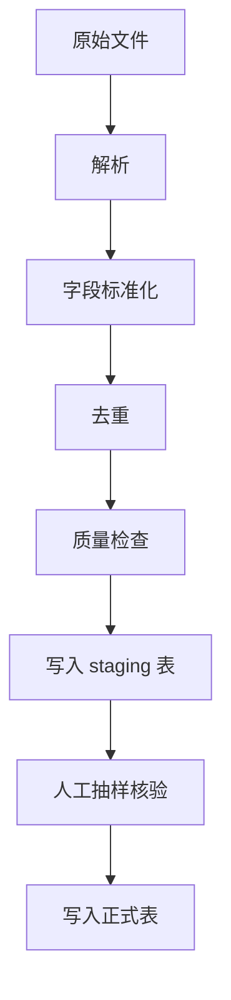

# Import Plan

这个文件描述真实数据如何从本地文件进入数据库。它是计划文档，不包含任何真实全量数据。

## 目标

把原来写在前端 JS 文件里的招生数据，迁移成数据库查询模式。

## 输入文件类型

可能来源：

- 河南省教育考试院 Excel / 网页表格
- 阳光高考院校与专业页面
- 第三方平台导出的 Excel / CSV
- 一分一段表 PDF / Excel
- 招生章程 PDF

## 导入流程



## 字段标准化

学校字段：

- school_name
- province
- city
- nature
- level

专业字段：

- major_name
- major_code
- category
- tuition
- requirements

录取字段：

- year
- province
- subject
- batch
- min_score
- min_rank
- plan_count
- source

## 质量规则

导入时必须检查：

- 分数是否在 0-750。
- 位次是否大于 0。
- 年份是否在合理范围内。
- 同一学校、专业、年份、批次是否重复。
- 学校名是否存在明显 OCR 错误。
- 专业名是否为空。
- 科类是否统一成 `history` / `physics` / `arts` / `science`。

## 推荐查询策略

用户输入分数和位次后，不应该返回全量表，而应该查询附近区间：

```sql
select *
from admission_records
where province = '河南'
  and subject = $1
  and batch = $2
  and min_score between $3 - 40 and $3 + 30
order by abs(min_score - $3), min_rank nulls last
limit 200;
```

再由推荐算法进行二次排序。

## AI 使用策略

给 AI 的输入只包含：

- 用户画像
- 后端筛选出的候选池
- 推荐算法生成的理由
- 必要的风险提示

不给 AI：

- 全量数据库
- API Key
- 未授权原始文件
- 其他用户记录

## 开源注意事项

公开仓库只放：

- 这个导入计划
- schema
- 10 条以内手写样例数据
- 不含真实授权风险的 mock 数据

不要放：

- 完整河南数据
- 付费数据源原始文件
- 真实访问码
- 真实咨询日志
